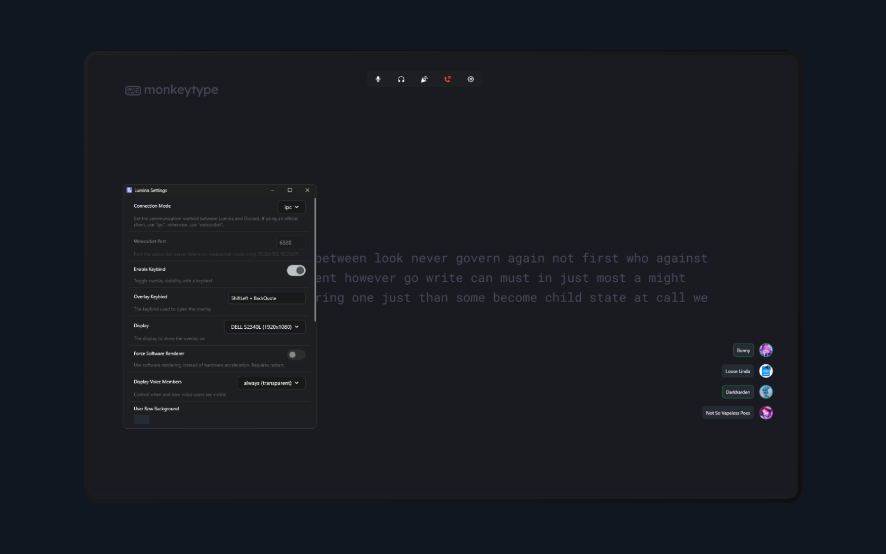

# Lumina



Quick, small, native, multi-platform Discord overlay alternative, with some enhancements.

This is a fork of [Orbolay](https://github.com/SpikeHD/Orbolay) with additional features and customization options.

---

## Features

* Voice channel member list and status (who is speaking/muted/deafened/etc)
* Custom notifications
* Mute/deafen/disconnect controls
* Soundboard buttons
* Customizable layout, colors, border radius, etc.
* Configurator settings window with live preview
* Customizable keybinds for all actions
* Tray icon with quick access to settings and quit
* User row background color picker (with HSV gradient)
* Voice and notification offset positioning
* Streaming indicator icon
* Speaking border indicator (green outline on active users)

## Installation

1. Download the latest [release](https://github.com/schalkburger/Lumina/releases)
2. Run the executable

## How to Use

| Action              | Default Keybind     |
|---------------------|---------------------|
| Open/close overlay  | Left Shift + `      |
| Open configurator   | C                   |

## Configuration

Lumina stores its configuration in:

### Windows

```
C:\Users\<username>\AppData\Roaming\lumina
```

### Linux

```
~/.config/lumina
```

### macOS

```
~/Library/Application Support/lumina
```

Configuration is saved as `config.json` and is automatically reloaded when changed.

## Build from Source

### Prerequisites

- [Rust](https://www.rust-lang.org/tools/install) (1.95+)
- Windows: No additional dependencies
- Linux: `libfontconfig-dev`, `libwayland-dev`, `libxkbcommon-dev`

### Build

```bash
cargo build --release
```

The binary will be at `target/release/lumina` (or `lumina.exe` on Windows).

## License

MIT
